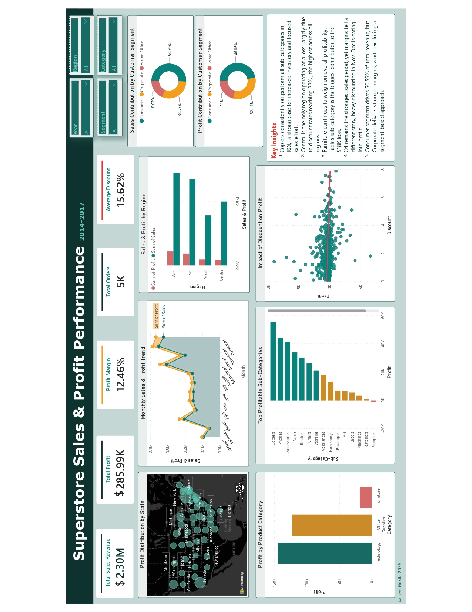

# 🛒 Superstore Sales & Profit Analysis

## 📌 Overview
An end-to-end data analysis project analyzing 4 years 
of Superstore retail data (2014–2017) to uncover 
key business insights using SQL and Power BI.

## 🛠️ Tools Used
| Tool | Purpose |
|------|---------|
| Excel | Initial data inspection and validation |
| MySQL | Data cleaning and analysis |
| Power BI | Interactive dashboard and visualization |

## 📊 Dashboard Preview

## 🔍 Key Findings
1. Copiers deliver the highest ROI across all sub-categories
2. Central is the only loss-making region — driven by 22% discount rate
3. Furniture generates a net loss (-$18K) — Tables is the biggest drag
4. Discounts above 20% consistently yield negative profit
5. Corporate segment is more profitable per dollar than Consumer

## 📁 Files
| File | Description |
|------|-------------|
| superstore_queries.sql | SQL queries for data cleaning and analysis |
| Superstore_Dashboard.pbix | Power BI interactive dashboard |
| Superstore_Presentation.pdf | Full project presentation |
| dashboard_screenshot.png | Dashboard preview image |
| Sample_Superstore.csv | Dataset used in this project |

## 📂 Dataset
- Source: [Kaggle — Sample Superstore Dataset](https://www.kaggle.com/datasets/vivek468/superstore-dataset-final)
- Records: 9,988 rows
- Features: 21 columns
- Type: Retail transactional data

## 📬 Contact
**Leni Gustia**  
[LinkedIn](https://www.linkedin.com/in/leni-gustia-405a40294/) · [Email](mailto:lenigustia24@gmail.com)

---
© Leni Gustia 2026
